# Diagram Features And Syntax
StateSmith is based on UML2 StateMachines with a few differences.

If you are unfamiliar with the general UML state machine syntax, here are some great resources:
- [clickable diagram that highlights elements](https://statecharts.dev/concepts.html)
- [Derek Banas video](https://www.youtube.com/watch?v=_6TFVzBW7oo). Stop watching at package diagrams.


## General state behavior syntax
Each state behavior can have:
- a **trigger**: can be `enter`, `exit`, an event like `do` or a user specified event. User events can be any identifier that is a valid variable name. Regex: `[a-zA-z_]\w*`
- a **guard** condition: any code that will evaluate to a boolean. If it evaluates to false, the behavior is not taken. Guard code should not have any side effects.
- an **action**: code that will be executed if the behavior is taken.
- a **transition** : transitions are drawn in the diagram.

Examples:
- ` SOME_EVENT1 [some_guard_code] / some_action();`
- ` SOME_EVENT2 [some_guard_code()]`
- ` BLINK` - blink event
- ` [some_guard_code] / some_action();`
- ` [some_guard_code]`
- ` / some_action();`
- ` / { some_action(); more_action(); }`

---

## Important note about shapes
You can use almost any yEd shape for states as long as the labels match the expected format.
You can stylize and color them however you want.

In some cases, we also hide the labels in yEd. This is common for the initial state (black circle).
Its label (when not hidden) is actually `$initial_state` (more details below).

  


---

## Extension to UML: support behavior ordering
StateSmith allows you to specify the order in which state behaviors are evaluated as shown below.
Decimal syntax is allowed so that you can easily insert a behavior between say `1` and `2` without
having to reorder the existing behaviors. If we make a custom UI, it would be great to have it
help with auto re-ordering.

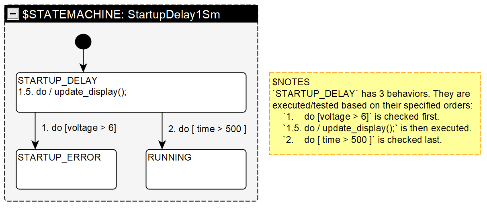


---

## Supports hierarchical states
Nesting states as described in UML.

### State enter behaviors
In the below diagram, the transition from `SELECT_CLASS` into `SELECT_CLASS_OPTION` has the following effect:
- `SELECT_CLASS` is exited.
- `MAIN_MENU` is entered and runs its enter code `Display_menu_header("MAIN MENU");`
- `SELECT_CLASS_OPTION` is entered and it runs enter code `Display_menu_option("SELECT CLASS"); menu_at_top();`
### State exit behaviors
In the below diagram, the transition from `SELECT_CLASS_OPTION` into `SELECT_CLASS` has the following effect:
- `SELECT_CLASS_OPTION` is exited running `run_exit_1();`
- `MAIN_MENU` is exited running `run_exit_main_menu();`
- `SELECT_CLASS` is entered.

  

---

## Write Code Directly Or Use Expansions
You can write code directly in state behaviors or use StateSmith expansions.


### Plain code in behaviors:
Whatever you write, StateSmith will output.


Generated code:
```c
// state entry behavior:
{
    // uml action: self->vars.option_value = PlayerClass_HEAVY;
    self->vars.option_value = PlayerClass_HEAVY;
} // end of behavior code
```

### Using Expansions
StateSmith expansions act a lot like c macros or a template language and can often
lead to easier to follow diagrams. You declare the expansions once and then can use them throughout
the diagram.

In the below image, the use of the `set_option_class()` renders to the exact same code as the raw code option above.


```c
// state entry behavior:
{
    // uml action: set_option_class(HEAVY);
    self->vars.option_value = PlayerClass_HEAVY;
} // end of behavior code
```

Here's the Expansion definitions used above:
```c#
string set_option_class(string class_name) => $"{option_value} = PlayerClass_{class_name}";
string option_value => AutoVarName(); // outputs `self->vars.option_value`
```

Expansions can reference other expansions. Note that `set_option_class()` uses the `option_value` expansion.

Note that the syntax for describing expansions is just C# code. If the syntax looks a bit weird, take a look at [c# expression body members](https://learn.microsoft.com/en-us/dotnet/csharp/programming-guide/statements-expressions-operators/expression-bodied-members#properties). The user written C# expansions actually get executed when the state machine code is being built. An expansion can do things like check a database, get the current date/time... whatever you can code up.

The `option_value` expansion uses a special expansion `AutoVarName()` covered below.

### Special Expansions
There are a few StateSmith helper expansions that help prevent common copy paste errors.

`AutoVarName()` expands to the path to where the user's variables can be accessed `self->vars.` with the expansion name appended afterwards.
```c#
string i_like_turtles => AutoVarName(); // outputs `self->vars.i_like_turtles`
```

`AutoNameCopy()` expands to just the expansion name.
```c#
// Ends up as "Display_menu_at_top()"
string menu_at_top() => "Display_" + AutoNameCopy() + "()";

// Ends up as "Display_menu_at_mid()"
string menu_at_mid() => $"Display_{AutoNameCopy()}()"; // c# interpolated string
```

### Expansion syntax must match use in diagram

If you use an expansion like `menu_at_top()` (a function call) in a diagram, the expansion you write must also be a function otherwise it won't match.

This will match:
```c#
string menu_at_top() => "Display_menu_at_top()";
```

This will NOT match in diagram:
```c#
string menu_at_top => "Display_menu_at_top()";
```

And vice versa. If you use an expansion like `count` in a diagram, the expansion you write must also not be a function.

This will match:
```c#
string count => "self->vars.count";
```

This will NOT match:
```c#
string count() => "self->vars.count";
```

This is similar to how the C preprocessor works with macro definitions.

---

## Entry and Exit points
Feature is implemented. See issue for details: https://github.com/StateSmith/StateSmith/issues/3

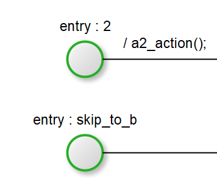
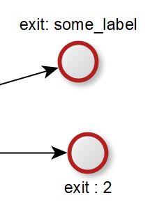

---

## Choice Pseudo States / Choice Points With `else`
StateSmith now supports Choice Pseudo States / Choice Points with `else`.

Choice points are not states. They can only be passed through during a transition.
This requires that they always have a default transition which is usually specified as `else`, but
it could also just be a default true transition with a higher order. In fact, `else` is just converted to a very large order number (see `Behavior.ELSE_ORDER`).

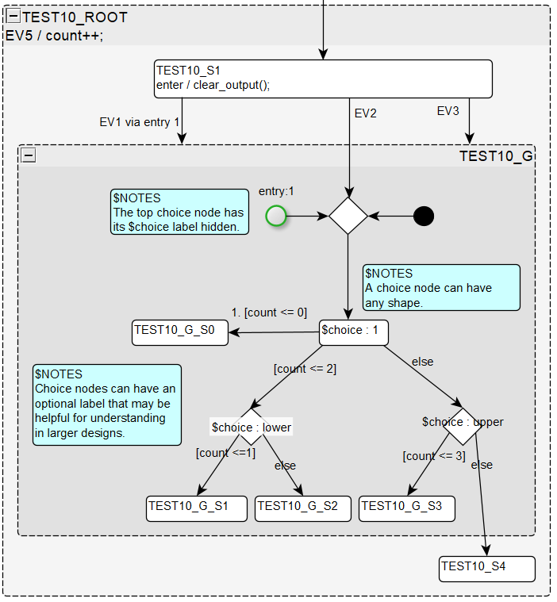

A choice diagram node can have any shape as long its text matches either `$choice` or `$choice : some_label`. StateSmith also supports [PlantUML choice states](https://plantuml.com/state-diagram#8bd6f7be727fb20e).

Choice point labels are optional and do not have to be unique.

You can choose to hide a `$choice` label.

https://github.com/StateSmith/StateSmith/issues/40

---

## Initial States, Entry Points and Exit Points now behave like Choice Points
StateSmith 0.5.9 had a limitation of a single transition for initial states, entry points, exit points, but this has been lifted. These pseudo states now behave a lot like Choice Points.

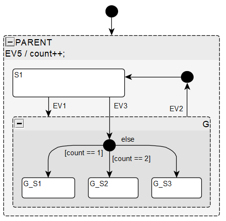  

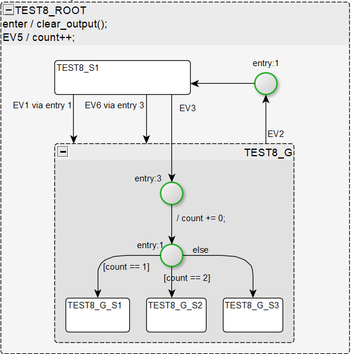  

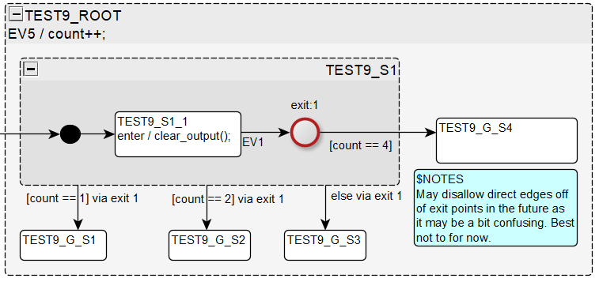  

https://github.com/StateSmith/StateSmith/issues/40

---

## `$PARENT_ALIAS`
A parent alias is a convenient way of referring to a state but from within it.
Very useful when a group is collapsed.

Used in laser tag menu example:

  

Feature has an initial implementation although it needs more rigorous testing against unexpected uses.
https://github.com/StateSmith/StateSmith/issues/2

---

## Special diagram labels
- `$STATEMACHINE` - defines a state machine. Must be root node in a diagram.
- `$initial_state` - detailed above.
- `$NOTES` - allows you to write notes. Can enclose other states if you want to ignore them. Kinda like an `#ifdef 0` on a bunch of code.
- `$PARENT_ALIAS` - detailed above.
- `$ortho_state` - orthogonal state. Not supported yet.

---

## UML difference - local transitions only (for now)
UML distinguishes between local and external transitions (see below). Local transitions don't exit the parent, external transitions do.

StateSmith currently doesn’t support graphically determining local versus external transitions due to limitations of drawing tools. You can’t draw the diagrams shown in (a) below with yEd, and you can't draw the diagrams shown in (b) with PlantUML. Because of these drawing tool limitations, StateSmith considers all the transitions in the image below to be local. Don't worry though, there are a few easy ways to make achieve the desired effect with clarity using StateSmith.

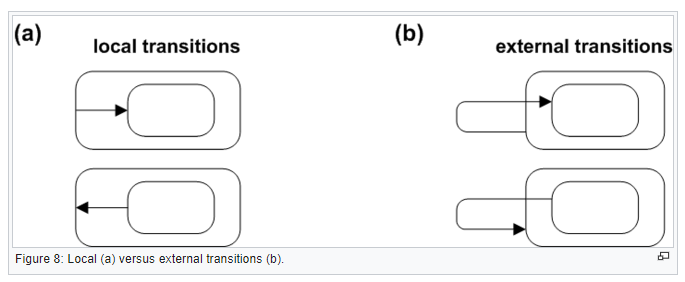  

You can achieve unambiguous external transitions as shown below.

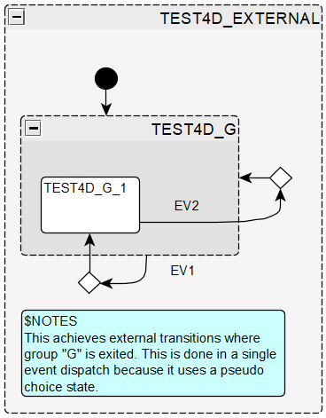  

Here's the test output for the above diagram when trace information is added:

```
Dispatch event EV1
===================================================
State TEST4D_G: check behavior `EV1 TransitionTo(TEST4D_EXTERNAL.ChoicePoint())`. Behavior running.
Exit TEST4D_G.
Transition action `` for TEST4D_G to TEST4D_EXTERNAL.ChoicePoint().
Transition action `` for TEST4D_EXTERNAL.ChoicePoint() to TEST4D_G_1.
Enter TEST4D_G.
Enter TEST4D_G_1.

Dispatch event EV2
===================================================
State TEST4D_G_1: check behavior `EV2 TransitionTo(TEST4D_EXTERNAL.ChoicePoint())`. Behavior running.
Exit TEST4D_G_1.
Exit TEST4D_G.
Transition action `` for TEST4D_G_1 to TEST4D_EXTERNAL.ChoicePoint().
Transition action `` for TEST4D_EXTERNAL.ChoicePoint() to TEST4D_G.
Enter TEST4D_G.
```

The transitions in the below diagrams are local. The "TEST4C" example is arguably more clear, but they are both effectively the same.

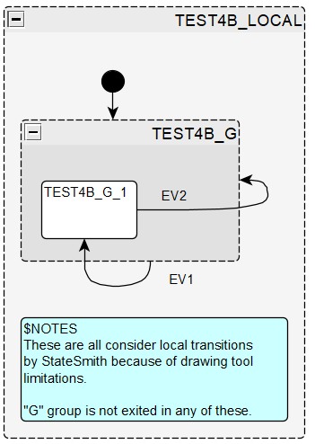
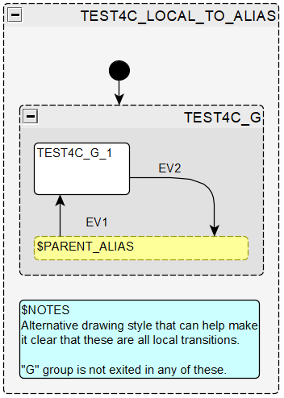  

Here's the test output for the above "4B" diagram when trace information is added:

```
Dispatch event EV1
===================================================
State TEST4B_G: check behavior `EV1 TransitionTo(TEST4B_G_1)`. Behavior running.
Transition action `` for TEST4B_G to TEST4B_G_1.
Enter TEST4B_G_1.

Dispatch event EV2
===================================================
State TEST4B_G_1: check behavior `EV2 TransitionTo(TEST4B_G)`. Behavior running.
Exit TEST4B_G_1.
Transition action `` for TEST4B_G_1 to TEST4B_G.
```

Here's the test output for the above "4C" diagram when trace information is added:

```
Dispatch event EV1
===================================================
State TEST4C_G: check behavior `EV1 TransitionTo(TEST4C_G_1)`. Behavior running.
Transition action `` for TEST4C_G to TEST4C_G_1.
Enter TEST4C_G_1.

Dispatch event EV2
===================================================
State TEST4C_G_1: check behavior `EV2 TransitionTo(TEST4C_G)`. Behavior running.
Exit TEST4C_G_1.
Transition action `` for TEST4C_G_1 to TEST4C_G.
```

---

## Event handling
When an event is dispatched to a state machine, the active state first gets a chance to handle it. If it doesn't handle the event, then its parent gets a chance... all the way up to the state machine root.

An event `EV1` is handled/consumed if a state has a behavior with trigger `EV1` and a guard that evaluates to true.

There is one exception - the `do` event. The `do` event is special in that state behaviors don't normally consume it. This allows child and parent states to `do` some work all the way up the chain.

If a transition occurs, no other behaviors will be checked for any state (doesn't matter if it is the `do` event).

State's can choose to not consume an event or consume the `do` event modifying a state's `consume_event` flag (see a state's event handler code).

If any of this is confusing, just read the generated comments for a state's event handler. They try to be pretty explanatory.

StateSmith's balanced generated code automatically skips over parent states that aren't interested in an event. This is especially helpful when debugging, or when the nesting gets past a few layers deep.


---

## If no event is specified
If no event is specified on a transition, StateSmith will automatically assume it uses the `do` event.

--- 

## Transition action code runs after states exited
StateSmith now follows the UML specification which states that a transition's action code is run after
states have been exited and before states are entered. StateSmith 0.5.9 would run transition action code before exiting states.

The design below comes from the [wikipedia UML state machine page](https://en.wikipedia.org/wiki/UML_state_machine#Transition_execution_sequence).

When event `T1` is dispatched to `S1_1`, the state machine outputs the following: `g() a(); b(); t(); c(); d(); e();`

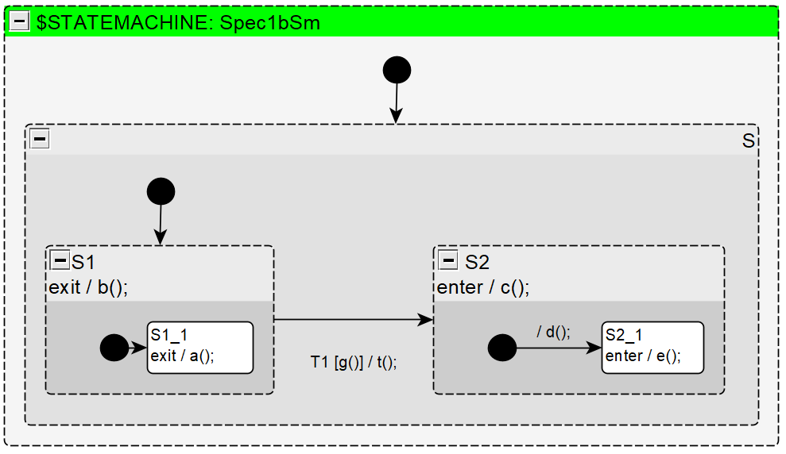

Additional info: https://github.com/StateSmith/StateSmith/issues/6
